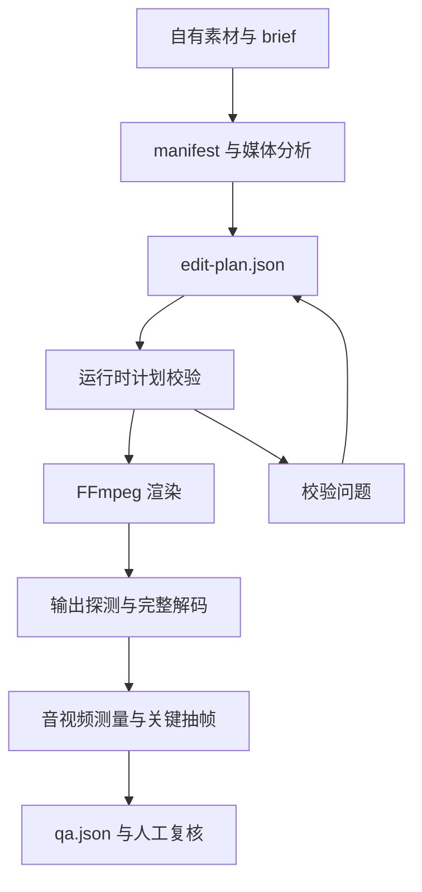

# Codex Auto Video Lab

**把剪辑方案保存为可校验的 JSON，再用 FFmpeg 执行，并检查实际输出文件。**

自动剪辑需要明确很多参数：哪份素材的哪一段、裁切到什么画幅、是否变速、保留哪些声音、字幕放在哪里、最终输出多长。只保留一句自然语言要求，后续很难定位为什么结果不符合预期。

Auto Video Lab 将这些决定写入 `edit-plan.json`。素材准备、分析、计划、渲染和技术 QA 分成独立阶段，每阶段保留自己的文件。上层工具可以提出剪辑方案，底座负责检查能否执行，并给出真实文件的技术测量与复核证据。

它是 [镜序影像创作台](https://github.com/h296025733-sys/jingxu-director-workbench) 使用的本地媒体底座，也可以通过 Python CLI 和 `studio.ps1` 单独使用。

## 一次任务怎样组织

以一份自有产品演示视频为例，希望保留镜头顺序和原声，加入字幕，再检查导出文件：

```text
输入素材 + 制作要求
  → 复制素材，建立清单与哈希
  → 探测媒体，收集分析证据
  → 生成或修改剪辑单
  → 校验路径、区间、画面和声音约束
  → FFmpeg 渲染
  → 完整解码、媒体测量和关键时点抽帧
  → 读取报告，人工播放复核
```

前面的计划校验回答“这份方案能否按约定执行”；后面的 QA 回答“实际文件在检查范围内有什么结果”。最终内容是否表达清楚、字幕是否准确和画面是否自然，仍需要观看输出。

## 支持的处理环节

| 环节 | 实现范围 |
| --- | --- |
| 素材管理 | 独立任务目录、素材副本、清单、哈希与媒体探测 |
| 分析 | 基础媒体证据、可选转录和编辑所需信息 |
| 时间轴 | 视频 / 图片片段、源区间、拼接、变速与画幅处理 |
| 画面层 | 字幕、文字、画中画与叠加元素 |
| 声音 | 原声、分段配音、背景音乐与响度相关处理 |
| 渲染 | 校验后的计划转换为 FFmpeg 命令与输出记录 |
| 技术 QA | 流信息、解码、时长、分辨率、帧率与音频测量 |
| 局部修补 | 水印区域、字形蒙版、时间范围与区域外保真度检查 |

高级声音与修补路径有额外的依赖和素材条件。公开仓库没有打包模型、第三方工具可执行文件或个人素材。

## 阶段之间的约定



JSON Schema 保存数据结构说明，运行时约束由 `plan.py` 等模块执行。这里没有把“仓库中存在 Schema”写成“每次渲染都调用了通用 JSON Schema 校验引擎”；两者需要区分。

## 剪辑单为什么要成为独立文件

### 可读：每个决定有明确字段

计划包括任务标识、输出规格、片段、画中画、叠加层和音乐等内容。片段指向素材，视频片段还需要源时间范围；输出定义文件名、分辨率、帧率和编码参数。

一些路径还记录片段的视觉职责，例如开头、问题、动作、证明和收尾。职责帮助解释安排意图，不能仅靠标签证明画面真的起到了对应作用。

### 可查：从字段回到实际素材

输入路径要落到任务素材范围内，源区间不能超过真实时长，输出约束需要能被渲染器支持。声音、字幕与叠加层也有各自的运行时检查。

有了独立计划，错误可以定位到具体素材或字段，而不是只得到一次 FFmpeg 的最终报错。

### 可改：规划和执行使用不同职责

上层 Codex 或人工可以修改计划，但底座仍按约束检查。自动草案适合作为保守起点，不能直接理解为已经完成创作判断。修改计划之后，要重新执行校验与渲染，旧 QA 不能代替新版本输出。

## 任务目录与产物

任务 ID 只允许受限的字母、数字、下划线和连字符，最大 64 字符，不接受任意路径。`JobPaths` 根据任务 ID 建立固定目录结构：

```text
jobs/demo-001/
  brief.txt             制作要求
  manifest.json         素材清单与对应信息
  edit-plan.json        剪辑计划
  inputs/               素材副本
  work/                 处理中间文件
  output/               渲染输出
  reports/
    analysis.json       分析证据
    qa.json             技术检查结果
```

这是目录约定示意，实际任务还会产生相应阶段的辅助文件。任务目录与输入素材被 Git 忽略，不作为公开样例上传。

清单、计划和输出分别存在，方便检查某个结果用了哪些输入。哈希用于核对文件内容，不能代替素材权利证明，也不能证明观看者已经完成画面验收。

## 音频：保留原声、配音和背景音乐分别考虑

原声、配音和背景音乐在视频中有不同作用。保留产品操作声与保留口播字幕不是同一个要求；增加配音也可能改变时长和音乐压低时机。

声音模块处理分段配音及相关合成参数，计划侧检查对应约束，QA 再测量实际音轨。背景音乐压低、响度、峰值与静音检测可以发现部分技术问题，但不判断口播内容是否正确或声音是否符合人物。

项目包含第三方声音能力的适配，使用前需准备相应模型与环境。有关依赖和素材许可，见 [第三方说明](THIRD_PARTY_NOTICES.md)。

## QA：进程退出成功之后，还要检查什么

| 检查 | 回答的问题 | 不能据此推出什么 |
| --- | --- | --- |
| 容器与流探测 | 是否有预期视频 / 音频流，参数是什么 | 画面内容符合要求 |
| 完整解码 | 输出是否能在检查流程中读完整 | 任意播放器都无兼容问题 |
| 时长与帧率 | 实际输出与计划是否一致或在检查范围内 | 节奏有吸引力 |
| 分辨率 | 输出画幅和尺寸是什么 | 主体裁切自然 |
| 音频测量 | 响度、峰值、静音等技术信息 | 文本、发音和听感准确 |
| 关键时点抽帧 | 叠加层与字幕出现处的画面证据 | 全片每帧都已人工检查 |

报告记录的是执行过的检查范围。出现未测项目或不支持条件时，应保留对应状态，而不是把缺失指标自动写成通过。

## 局部水印处理：约束改动范围

相关路径先记录区域、起止时间、证据时点、字形蒙版和是否适合处理。部分实现直接在解码平面上只写入蒙版范围，再测量区域外的保真度，减少局部修补对整张画面的影响。

需要分清两种质量：区域外是否按约束保留，以及被遮挡区域的估计是否自然。前者可以用像素与格式信息检查，后者仍依赖原画面纹理、运动与人工观看。

水印修补不能恢复不存在的原始像素。运动背景、遮挡、HDR、色彩格式和不支持的编码条件都有局限，仅应处理自己有权修改的素材。

相关实现分别在 `watermark_fidelity.py`、蒙版、字形和修补模块中，不是一个适用于任意片段的通用成功承诺。

## 本地准备

项目要求 Python 3.12，按当前 `pyproject.toml` 安装：

```powershell
python -m venv .venv
.\.venv\Scripts\python.exe -m pip install -e ".[dev]"
```

将 FFmpeg 与 ffprobe 放到 `tools/ffmpeg/bin/`，按采用版本检查 `config/toolchain.json` 中的路径与工具信息。PowerShell 入口使用本仓库 `.venv\Scripts\python.exe`；只有系统 Python 可用，并不足以保证该入口能运行。

| 配置或依赖 | 用途 |
| --- | --- |
| `config/toolchain.json` | 本地媒体工具路径与版本信息 |
| `config/edit-plan.schema.json` | 剪辑计划结构说明 |
| `config/voiceover-spec.schema.json` | 配音相关结构说明 |
| FFmpeg / ffprobe | 探测、渲染与技术检查 |
| 可选模型 | 转录与高级声音等功能 |

字体和贴纸等随仓库分发的资源保留各自许可；使用新的字体、音乐、图片和参考片时，需要自行确认授权。

## 分步运行一个任务

下面命令使用示例任务名。`inputs/demo.mp4` 需要换成自己已经准备的素材：

```powershell
.\studio.ps1 create --job demo-001 --asset "inputs/demo.mp4" --brief "保留原声和镜头顺序，增加英文字幕"
.\studio.ps1 analyze --job demo-001
.\studio.ps1 draft-plan --job demo-001 --title "产品演示"
.\studio.ps1 validate --job demo-001
.\studio.ps1 render --job demo-001
.\studio.ps1 qa --job demo-001
```

需要转录时，在分析阶段使用 `--transcribe`，并准备相应依赖和模型；需要烧录字幕时，再按实际字幕与计划使用 `--burn-captions`。建议先检查每步产物，再开始下一步。

程序入口也可以通过安装后的 `auto-video` 或 `python -m auto_video_lab.cli` 使用；`studio.ps1` 是 Windows 下的便捷包装。

## 代码阅读顺序

| 模块 | 用途 |
| --- | --- |
| [cli.py](src/auto_video_lab/cli.py) | 查看阶段命令与参数 |
| [paths.py](src/auto_video_lab/paths.py) | 任务 ID 与目录约定 |
| [analysis.py](src/auto_video_lab/analysis.py) | 素材探测与分析证据 |
| [plan.py](src/auto_video_lab/plan.py) | 草案和运行时计划约束 |
| [render.py](src/auto_video_lab/render.py) | FFmpeg 命令与输出过程 |
| [qa.py](src/auto_video_lab/qa.py) | 技术检查、测量与报告 |
| [voiceover.py](src/auto_video_lab/voiceover.py) | 声音路径 |
| [watermark_fidelity.py](src/auto_video_lab/watermark_fidelity.py) | 解码平面与局部修改保真度 |

如果想理解执行链，按 CLI → 路径 → 计划 → 渲染 → QA 阅读；如果想理解具体质量约束，再进入声音或水印模块与对应测试。

## 验证范围

2026-10-07 执行了四个选定 pytest 文件中的 80 个用例，包括部分实际 FFmpeg 合成音频读取，其余部分使用替代命令与测试输入。实际集合见 [检查记录](docs/verification.md)。

没有执行完整真实视频渲染、模型配音和真实素材水印修补的端到端验收。计划检查、合成样例测量和真实素材观看属于不同证据；当前测试不能替代后一种验收。
