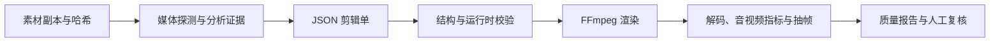

# Codex Auto Video Lab

**用可检查的 JSON 剪辑单驱动 FFmpeg，再检查渲染出来的文件。**

一个剪辑方案里有素材、源区间、速度、字幕、声音和叠加元素。把这些约定保存在 `edit-plan.json`，就能在渲染前发现不合法的区间与路径，也能在成片有问题时追到具体参数。

这是 [镜序影像创作台](https://github.com/h296025733-sys/jingxu-director-workbench) 使用的本地媒体处理基础，同时保留独立的 Python CLI 和 PowerShell 入口。

## 从素材到检查报告



视频与图片可以拼接、裁切、变速，叠加字幕和文字；音频路径处理分段配音、背景音乐压低与响度。分析、计划、渲染和 QA 分成独立步骤，各阶段保留文件，便于检查中间结果。

## 我在这里解决的几个问题

**计划必须能落到真实素材上。** JSON Schema 描述结构，运行时再检查素材路径、时间区间、输出时长和音视频约束。渲染命令从校验后的计划生成。

**工具退出成功之后还要检查文件。** QA 会读取容器与流信息、尝试完整解码，并记录分辨率、时长、帧率和音频检查结果。关键叠加时点也会抽帧，供人复核文字和画面。

**局部修补需要说明改动范围。** 水印处理保留实际字形蒙版与时间范围，部分路径在解码平面上只写入蒙版内的像素，并记录区域外保真度。修补只是对被遮挡纹理的估计，运动、遮挡和不支持的格式仍有局限。

## 代码入口

| 想看什么 | 从哪里开始 |
| --- | --- |
| 剪辑单的数据约定 | [edit-plan.schema.json](config/edit-plan.schema.json) |
| 区间、素材与音频约束 | [plan.py](src/auto_video_lab/plan.py) |
| FFmpeg 命令与渲染过程 | [render.py](src/auto_video_lab/render.py) |
| 成片检查和报告范围 | [qa.py](src/auto_video_lab/qa.py) |
| 蒙版与区域外保真度 | [watermark_fidelity.py](src/auto_video_lab/watermark_fidelity.py) |
| 任务路径隔离 | [paths.py](src/auto_video_lab/paths.py) |

## 本地准备

使用 Python 3.12，安装项目依赖：

```powershell
python -m venv .venv
.\.venv\Scripts\python.exe -m pip install -e ".[dev]"
```

将 FFmpeg / ffprobe 放到 `tools/ffmpeg/bin/`，按采用的版本更新 `config/toolchain.json`。仓库不打包 Python 环境、模型、工具可执行文件和个人素材。部分高级语音模块还需要自行准备相应第三方模型，见 `THIRD_PARTY_NOTICES.md`。

```powershell
.\studio.ps1 create --job demo-001 --asset "inputs/demo.mp4" --brief "保留原声和镜头顺序，增加英文字幕"
.\studio.ps1 analyze --job demo-001 --transcribe
.\studio.ps1 draft-plan --job demo-001 --title "产品演示" --burn-captions
.\studio.ps1 validate --job demo-001
.\studio.ps1 render --job demo-001
.\studio.ps1 qa --job demo-001
```

水印修补只能估计被遮挡的纹理，当前实现也不能代表任意运动、遮挡、HDR 或编码格式都适用。方案校验、合成样片和真实素材验收分别记录，不能互相替代。

## 本次公开整理的检查

见 [检查记录](docs/verification.md)，其中区分源码与语法检查、隔离测试和未执行的真实环境路径。
